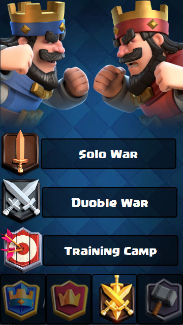
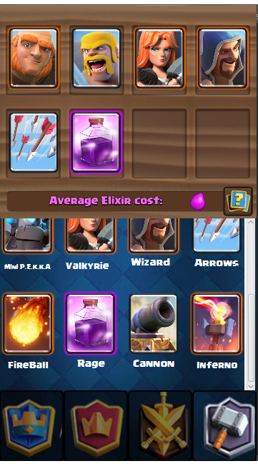
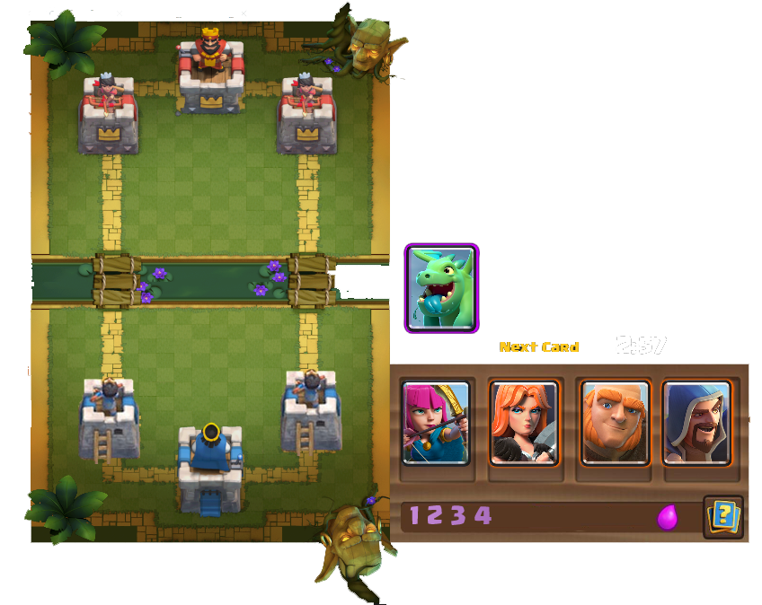

# Clash Royale
   

 As final project in advanced programming course at [Amirkabir University of Technology (Tehran Polytechnic)](https://aut.ac.ir), students were asked to Develop a clone version of [Supercell's Clash Royal](https://supercell.com/en/games/clashroyale/) using javafx, and
java-core.  

## Game Concept
In Clash Royale, two (or four in two VS two) players should fight in an arena using a variety of cards which are randomly given through the game flow from a set that the player chooses before the game starts (Deck). each player has 3 towers with defensive abilities, the first player to destroy opponent's King towers is the winner. if the time runs out player with more healthy towers wins the game with fewer points.

# Game Elements
- Towers
- Cards
- AI

## Towers

Game had two kind of defensive towers:

- King Tower
- Princess Tower

## Cards

Game contains three kind of cards: Troops, Buildings, Spells

### troops

list of Troops:

- Barbarians
- Archers
- Baby Dragon
- Wizard
- Mini Peka
- Giant
- Valkyrie

### spells

list of spells:

- Rage
- Fire Ball
- Arrows

### buildings

list of buildings:

- Cannon
- Inferno Tower

## AI

### Opponent AI
Game provides two types of opponent AI in training camp. 
- first AI is very simple and just randomly selects a card and a location on map to place the card.

- second type of AI scans the current status of map and cards available, and decides accordingly. this type had a recording set of player's previous games and kept the probability of player placing a card in a special location.

### Troops AI
each kind of troop in placed in the map, had a simple AI to do its task, hit enemy troops and move toward enemy towers

# Screen Shots

  
  
